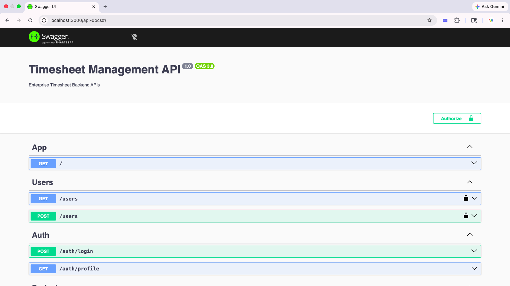

# Enterprise Timesheet Management System - Backend Architecture & Workflow Documentation

## Overview

This document describes the complete backend architecture, workflows, RBAC structure, approval lifecycle, APIs, and system design for the Enterprise Timesheet Management System.

---



# Technology Stack

| Layer               | Technology                       |
| ------------------- | -------------------------------- |
| Backend Framework   | NestJS                           |
| ORM                 | Prisma ORM                       |
| Database            | MySQL                            |
| Authentication      | JWT Authentication               |
| Authorization       | RBAC (Role Based Access Control) |
| API Documentation   | Swagger UI                       |
| Validation          | class-validator                  |
| Password Encryption | bcrypt                           |
| Language            | TypeScript                       |

---

# System Architecture Diagram

```text
┌───────────────────────────────────────────────┐
│                CLIENT APPLICATIONS            │
│-----------------------------------------------│
│ Swagger UI                                    │
│ Angular Frontend                              │
│ Postman / API Clients                         │
└───────────────────────────────────────────────┘
                    │
                    ▼
┌───────────────────────────────────────────────┐
│                NESTJS API SERVER              │
│-----------------------------------------------│
│ Controllers                                   │
│ - AuthController                              │
│ - UsersController                             │
│ - ProjectsController                          │
│ - UserProjectsController                      │
│ - TimesheetsController                        │
│ - ApprovalsController                         │
│                                               │
│ Guards                                        │
│ - JWT Auth Guard                              │
│                                               │
│ Services                                      │
│ - AuthService                                 │
│ - UsersService                                │
│ - ProjectsService                             │
│ - UserProjectsService                         │
│ - TimesheetsService                           │
│ - ApprovalsService                            │
└───────────────────────────────────────────────┘
                    │
                    ▼
┌───────────────────────────────────────────────┐
│                 PRISMA ORM                    │
│-----------------------------------------------│
│ Database Models                               │
│ Query Builder                                 │
│ Transactions                                  │
│ Validation                                    │
└───────────────────────────────────────────────┘
                    │
                    ▼
┌───────────────────────────────────────────────┐
│                  MYSQL DATABASE               │
│-----------------------------------------------│
│ users                                         │
│ projects                                      │
│ user_projects                                 │
│ timesheets                                    │
│ approvals                                     │
└───────────────────────────────────────────────┘
```

---

# High Level Workflow Diagram

```text
ADMIN CREATES USERS
        │
        ▼
MANAGER ASSIGNED TO EMPLOYEE
        │
        ▼
ADMIN / MANAGER CREATES PROJECTS
        │
        ▼
PROJECT ASSIGNED TO EMPLOYEE
        │
        ▼
EMPLOYEE SUBMITS TIMESHEET
        │
        ▼
TIMESHEET STATUS = SUBMITTED
        │
        ▼
MANAGER / ADMIN REVIEWS
        │
 ┌──────┴─────────┐
 │                │
 ▼                ▼
APPROVED      REJECTED
 │                │
 ▼                ▼
APPROVALS TABLE AUDIT ENTRY
```

---

# Database Tables

## users

Stores all system users.

| Column        | Description                |
| ------------- | -------------------------- |
| id            | Primary key                |
| employee_code | Unique employee code       |
| first_name    | User first name            |
| last_name     | User last name             |
| email         | Login email                |
| password      | Hashed password            |
| role          | ADMIN / MANAGER / EMPLOYEE |
| manager_id    | Reporting manager          |
| is_active     | Active status              |
| created_at    | Created timestamp          |

---

## projects

Stores project details.

| Column       | Description              |
| ------------ | ------------------------ |
| id           | Primary key              |
| project_code | Unique project code      |
| project_name | Project name             |
| client_name  | Client name              |
| description  | Project description      |
| start_date   | Project start            |
| end_date     | Project end              |
| status       | ACTIVE / INACTIVE        |
| created_by   | User who created project |
| created_at   | Created timestamp        |

---

## user_projects

Mapping table between users and projects.

| Column                | Description           |
| --------------------- | --------------------- |
| id                    | Primary key           |
| user_id               | Employee ID           |
| project_id            | Project ID            |
| allocation_percentage | Allocation percentage |

---

## timesheets

Stores employee timesheet entries.

| Column           | Description                             |
| ---------------- | --------------------------------------- |
| id               | Primary key                             |
| user_id          | Employee ID                             |
| project_id       | Project ID                              |
| work_date        | Date worked                             |
| hours_worked     | Hours worked                            |
| task_description | Work description                        |
| status           | DRAFT / SUBMITTED / APPROVED / REJECTED |
| submitted_at     | Submission timestamp                    |
| created_at       | Created timestamp                       |
| updated_at       | Updated timestamp                       |

---

## approvals

Stores approval audit history.

| Column       | Description         |
| ------------ | ------------------- |
| id           | Primary key         |
| timesheet_id | Timesheet ID        |
| manager_id   | Approver ID         |
| status       | APPROVED / REJECTED |
| comments     | Review comments     |
| action_at    | Approval timestamp  |

---

# RBAC (Role Based Access Control)

## ADMIN

Permissions:

* Create users
* Create managers
* Create employees
* Create projects
* Assign projects to any employee
* View all users
* View all approvals
* Approve/reject any timesheet
* View all reports
* View all dashboards

---

## MANAGER

Permissions:

* View own employees only
* Assign projects to own employees only
* View pending approvals for own employees
* Approve/reject own employee timesheets
* View team dashboard
* View monthly reports for own employees

Restrictions:

* Cannot manage employees from other managers
* Cannot approve unrelated employees

---

## EMPLOYEE

Permissions:

* Login
* View own profile
* View assigned projects
* Create timesheets
* Submit timesheets
* View own timesheet history

Restrictions:

* Cannot approve timesheets
* Cannot assign projects
* Cannot create users

---

# Authentication Workflow

```text
USER LOGIN
    │
    ▼
/auth/login
    │
    ▼
Validate email/password
    │
    ▼
Generate JWT Token
    │
    ▼
Return access_token
    │
    ▼
Frontend stores token
    │
    ▼
Protected APIs use Bearer token
```

---

# Authorization Flow

```text
Incoming API Request
        │
        ▼
JWT Auth Guard
        │
        ▼
Validate Token
        │
        ▼
Extract User Payload
        │
        ▼
req.user = {
  userId,
  email,
  role
}
        │
        ▼
Service Level RBAC Validation
```

---

# User Management Workflow

```text
ADMIN CREATES USER
        │
        ▼
POST /users
        │
        ▼
Password hashed using bcrypt
        │
        ▼
User inserted into users table
        │
        ▼
Optional manager_id assigned
```

---

# Project Assignment Workflow

```text
ADMIN / MANAGER ASSIGNS PROJECT
        │
        ▼
POST /user-projects
        │
        ▼
Validate Employee Exists
        │
        ▼
Validate RBAC
        │
 ┌──────┴─────────────┐
 │                    │
ADMIN              MANAGER
 │                    │
Can assign any    Only own employees
employee          allowed
 │                    │
 └──────┬─────────────┘
        ▼
Insert into user_projects
```

---

# Timesheet Workflow

## Step 1 - Employee Creates Draft

```text
POST /timesheets
        │
        ▼
Validate employee assigned to project
        │
        ▼
Create timesheet
        │
        ▼
Status = DRAFT
```

---

## Step 2 - Employee Submits Timesheet

```text
PATCH /timesheets/{id}/submit
        │
        ▼
Validate owner
        │
        ▼
Validate status = DRAFT
        │
        ▼
Update status = SUBMITTED
        │
        ▼
submitted_at updated
```

---

# Approval Workflow

```text
MANAGER / ADMIN
        │
        ▼
GET /approvals/pending
        │
        ▼
Load SUBMITTED timesheets
        │
        ▼
Manager -> own employees only
Admin -> all employees
        │
        ▼
PATCH /approvals/{id}/action
        │
 ┌──────┴─────────┐
 │                │
 ▼                ▼
APPROVED      REJECTED
 │                │
 ▼                ▼
Update timesheet status
        │
        ▼
Insert approval audit record
```

---

# Dashboard Workflow

## Manager Dashboard

Calculates:

* Pending approvals
* Approved timesheets
* Rejected timesheets
* Total hours worked

Rules:

| Role    | Data Scope         |
| ------- | ------------------ |
| ADMIN   | All employees      |
| MANAGER | Own employees only |

---

# Reporting Workflow

## Monthly Employee Report

```text
GET /approvals/reports/monthly
        │
        ▼
Group approved timesheets
        │
        ▼
Aggregate monthly hours
        │
        ▼
Return employee-wise report
```

---

# Request Lifecycle

```text
HTTP Request
    │
    ▼
Controller
    │
    ▼
DTO Validation
    │
    ▼
JWT Authentication
    │
    ▼
Service Layer
    │
    ▼
RBAC Validation
    │
    ▼
Prisma ORM
    │
    ▼
MySQL Database
    │
    ▼
Response Returned
```

---

# API Security

## Password Security

* Passwords hashed using bcrypt
* Plain passwords never stored

---

## JWT Security

* Bearer token authentication
* Protected routes using AuthGuard
* Stateless authentication

---

## Authorization Security

* Service-level RBAC validation
* Manager hierarchy enforcement
* Ownership validation
* Approval restrictions

---

# Validation Rules

## Users

* Unique email
* Unique employee_code
* Required password
* Valid role

---

## Projects

* Unique project_code
* Required project_name

---

## Timesheets

* Employee must belong to project
* Only DRAFT can be submitted
* Only SUBMITTED can be approved/rejected

---

## Approvals

* Only MANAGER/ADMIN allowed
* Managers limited to own employees
* Admin can approve any employee

---

# Error Handling

## Common Prisma Errors

| Error Code | Meaning                     |
| ---------- | --------------------------- |
| P2002      | Unique constraint violation |
| P2003      | Foreign key violation       |

---

## HTTP Errors

| Status | Meaning               |
| ------ | --------------------- |
| 400    | Validation error      |
| 401    | Unauthorized          |
| 403    | Forbidden             |
| 404    | Resource not found    |
| 500    | Internal server error |

---

# Enterprise Features Implemented

## Authentication

* JWT Login
* Protected APIs
* Swagger bearer token support

---

## RBAC

* ADMIN
* MANAGER
* EMPLOYEE

---

## Hierarchical Reporting

* Manager → Employees relationship
* Scoped approvals
* Scoped project assignment

---

## Approval Audit Trail

* Approval history stored
* Comments supported
* Timestamp tracking

---

## Pagination

* Approval pagination
* Metadata support

---

## Search & Filtering

* Approval search
* Status filtering

---

# Current Backend Modules

```text
src/
│
├── auth/
├── users/
├── projects/
├── user-projects/
├── timesheets/
├── approvals/
├── prisma/
├── common/
└── dashboard/
```

---

# Swagger Documentation

Available at:

```text
http://localhost:3000/api-docs
```

Includes:

* Request payloads
* Response schemas
* Authorization support
* DTO examples
* API testing support

---

# System Strengths

## Enterprise Ready Features

* Layered architecture
* DTO validation
* JWT authentication
* RBAC authorization
* Transaction support
* Approval workflows
* Audit history
* Manager hierarchy
* Modular backend structure
* Swagger documentation

---

# End-to-End Business Flow

```text
1. ADMIN creates MANAGER
2. ADMIN creates EMPLOYEE
3. EMPLOYEE linked to MANAGER
4. ADMIN creates PROJECT
5. PROJECT assigned to EMPLOYEE
6. EMPLOYEE creates TIMESHEET
7. EMPLOYEE submits TIMESHEET
8. MANAGER reviews TIMESHEET
9. APPROVED / REJECTED
10. Approval history stored
11. Dashboard metrics updated
12. Monthly reports generated
```

---

# Conclusion

The backend system implements a complete enterprise-grade timesheet management workflow with:

* JWT authentication
* Hierarchical RBAC
* Project allocation
* Timesheet lifecycle management
* Approval workflows
* Dashboard analytics
* Reporting
* Audit history
* Swagger API documentation
* Secure Prisma ORM integration
* Modular NestJS architecture
